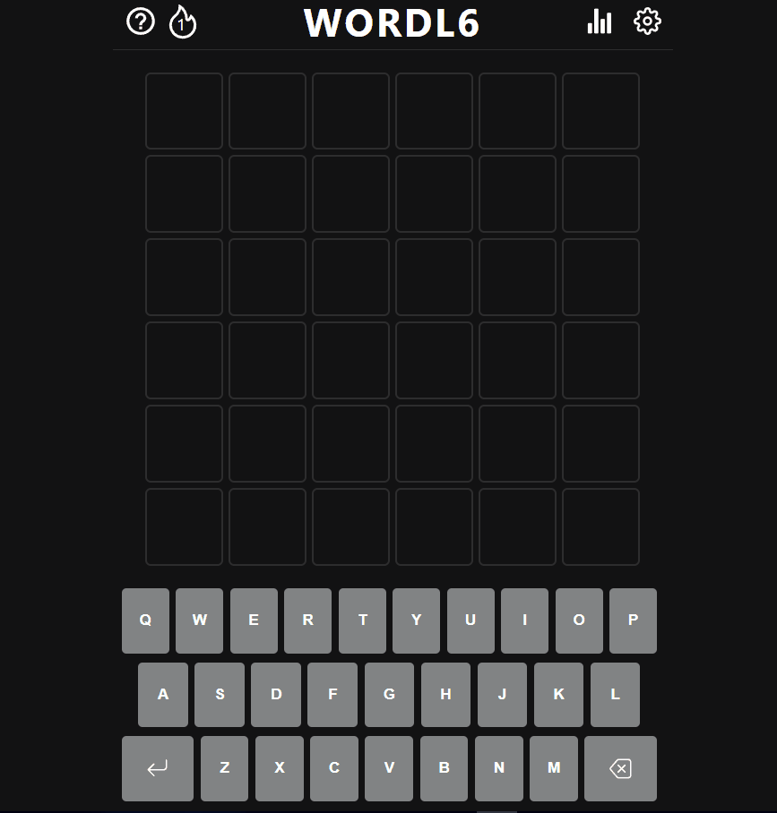

<h1 align="center">Wordl6</h1>

This is my recreation of the popular game [Wordle](https://www.nytimes.com/games/wordle/index.html 'Link to Wordle') but with 6 letter words instead of 5. It will keep track of games played and won, see how many you can get correct in a row. 

There is a known bug with the colour scheme on some devices. If the game text loads in black, go to settings (top right of navbar) and click the dark mode toggle. This will fix it and I am actively working on a solution. 

## Links 🌟

- Live site: [Try it out here 💻](https://wordl6-9ykof8r3j-thethomasy.vercel.app/ 'Live View')

## Screenshots 📷

  
<!--    -->

## Built With 🛠

- [Next.js](https://nextjs.org/) project bootstrapped with [`create-next-app`](https://github.com/vercel/next.js/tree/canary/packages/create-next-app).
- Scss

## Future Updates 🎁

- [ ] FIX: Known issues on Safari browser with colours and popup appearing behind grid
- [ ] FIX: Light/dark mode auto select causes flicker on page load
- [ ] ADD: State management/refactor in index.js
- [ ] ADD: High contrast mode

## Changelog

- **[1.0.0] 18/02/22 Deployment**: Working version deployed 

## Author 🧑

**Tom Young**

- [Github Profile 👨‍💻](https://github.com/TheThomasY)
- [Email ✉](mailto:tomyoungdev@gmail.com?subject=Hi 'Hi!')
- [LinkedIn 💼](https://www.linkedin.com/in/tom-young5555/)
- [Dev.to 🖊](https://dev.to/thetomy)

Give a ⭐️ if you like this project!

